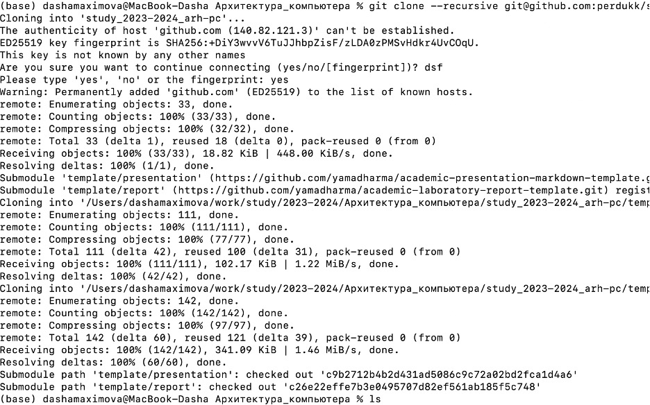

---
## Front matter
title: "Отчет по лабораторной работе №2"
subtitle: "Дисциплина: Архитектура компьютера"
author: "Максимова Дарья Валерьевна"

## Generic otions
lang: ru-RU
toc-title: "Содержание"

## Bibliography
bibliography: bib/cite.bib
csl: pandoc/csl/gost-r-7-0-5-2008-numeric.csl

## Pdf output format
toc: true # Table of contents
toc-depth: 2
lof: true # List of figures
lot: true # List of tables
fontsize: 12pt
linestretch: 1.5
papersize: a4
documentclass: scrreprt
## I18n polyglossia
polyglossia-lang:
  name: russian
  options:
	- spelling=modern
	- babelshorthands=true
polyglossia-otherlangs:
  name: english
## I18n babel
babel-lang: russian
babel-otherlangs: english
## Fonts
mainfont: IBM Plex Serif
romanfont: IBM Plex Serif
sansfont: IBM Plex Sans
monofont: IBM Plex Mono
mathfont: STIX Two Math
mainfontoptions: Ligatures=Common,Ligatures=TeX,Scale=0.94
romanfontoptions: Ligatures=Common,Ligatures=TeX,Scale=0.94
sansfontoptions: Ligatures=Common,Ligatures=TeX,Scale=MatchLowercase,Scale=0.94
monofontoptions: Scale=MatchLowercase,Scale=0.94,FakeStretch=0.9
mathfontoptions:
## Biblatex
biblatex: true
biblio-style: "gost-numeric"
biblatexoptions:
  - parentracker=true
  - backend=biber
  - hyperref=auto
  - language=auto
  - autolang=other*
  - citestyle=gost-numeric
## Pandoc-crossref LaTeX customization
figureTitle: "Рис."
tableTitle: "Таблица"
listingTitle: "Листинг"
lofTitle: "Список иллюстраций"
lotTitle: "Список таблиц"
lolTitle: "Листинги"
## Misc options
indent: true
header-includes:
  - \usepackage{indentfirst}
  - \usepackage{float} # keep figures where there are in the text
  - \floatplacement{figure}{H} # keep figures where there are in the text
---

# Цель работы

Целью данной работы является изумление идеологии и применение средств контроля версий, а также приобрести практические навыки работы с системой git.

# Задание

1. Настройка GitHub.
1. Базовая настройка Git.
1. Создание SSH-ключа.
1. Создание рабочего пространства и репозитория курса на основе шаблона.
1. Создание репозитория курса на основе шаблона.
1. Настройка каталога курса.
1. Выполнение заданий для самостоятельной работы.

# Теоретическое введение

Системы управления версией (Система управления версией, VCS) применяются при работе нескольких человек над одним проектом. Обычно основное дерево проекта хранится в локальном или удаленном репозитории, к которому настроен доступ для участников проекта. При внесении изменений в содержание проекта система контроля версий позволяет их фиксировать, совмещать изменения, произведенные разными участниками проекта, производить откат к любой более ранней версии проекта, если это требуется. В классических системах контроля версий используется централизованная модель, предполагающая наличие единого репозитория для хранения файлов. Выполнение большинства функций управления версиями осуществляется специальным сервером. Участник проекта (пользователь) перед началом работы с опреем опредедных команд получает нужную ему версию файлов. После внесения изменений пользователь размещает новую версию в хранилище. При этом предыдущие версии не удаляются из центрального хранилища и к ним можно вернуться в любой момент. Сервер может сохранять не полную версию измененных файлов, а производить так называемое дельта-сжатие — сохранять только изменения между последовательными версиями, что позволяет уменьшить объем хранимых данных. Системы контроля версий поддерживают возможность отслеживания и разрешения конфликтов, которые могут возникнуть при работе нескольких человек над одним файлом. Можно объединить изменения, сделанные разными участниками, вручную выбрать нужную версию, отменить изменения или заблокировать файлы для изменения. В зависимости от настроек блокировка не позволяет другим пользователям получить рабочую копию или препятствует изменению рабочей копии файла с средствами файловой системы ОС, обеспечивая таким образом привилегированный доступ только одному пользователю, работающему с файлом. Системы управления версиями также могут обеспечивать дополнительные, более гибкие функциональные возможности. Например, они могут поддерживать работу с несколькими версиями одного файла, сохраняя общую историю изменений до точки ветвления версий и собственные истории изменений каждой ветви. Обычно доступна информация о том, кто из участников, когда и какие изменения вносили. Обычно такая информация хранится в журнале изменений, доступ к которому можно ограничить. В отличие от классических, в распределённых системах управления версий центральный репозиторий не является обязательным. Среди классических VCS наиболее известны CVS, Subversion, а среди распределенных — Git, Bazaar, Mercurial. Принципы их работы похожи, они отличаются в основном синтаксисом используемых в работе команд. Система управления вериансиями Git представляет собой набор программ командной строки. Доступ к ним можно получить из терминала, введя git-колама с различными опциями. Благодаря тому, что Git является распределенной системой контроля версий, резервную копию локального хранилища можно сделать простым копированием или архивацией. Работа пользователя со своей веткой начинается с проверки и получения изменений из центрального репозитория (при этом в локальное дерево до начала этой процедуры не должно быть внесено изменений). Затем можно внести изменения в локальное дерево и/или ветку. После внесения каких-либоких-лименей в файлы и/или каталоги проекта необходимо разместить их в центральном репозитории.

# Выполнение лабораторной работы

Создаю учетную запись на сайте https://github.com/ и заполняю основные данные. (рис. [-fig:001])

{#fig:001 width=70%}

Делаю предварительную конфигурацию git, указав имя и email владельца репозитория (рис. [-fig:002])

{#fig:002 width=70%}

Настроим utf-8 в выводе сообщений git, зададим имя начальной ветке(будем называть её master), укажем значение параметров autocrlf и safecrlf (рис. [-fig:003])

{#fig:003 width=70%}

Для последующей идентификации пользователя на сервере репозиториев сгенерируем пару ключей (приватный и открытый) (рис. [-fig:004])

{#fig:004 width=70%}

(у меня уже был сгенерирован код)
Имеющийся ключ я загрузила на github, загрузив его в буфер обмена. Вставляю скопированный ключ в поле «Ключ». В поле Название указываю имя для ключа. Нажимаю «Добавить SSH-ключ», чтобы завершить добавление ключа. (рис. [-fig:005])

{#fig:005 width=70%}

Создадим каталог для предмета «Архитектура компьютера» для последующего создания рабочего пространства. (рис. [-fig:006])

{#fig:006 width=70%}

Через web-интерфейс github создадим репозиторий на основе шаблона, указав имя study_2024–2025_arh-рс (рис. [-fig:007])

{#fig:007 width=70%}

Перейдем в каталог курса и скопируем в него созданный репозиторий с помощью ссылки для клонирования: (рис. [-fig:008])

{#fig:008 width=70%}

Перейдём в каталог курса, удалим лишние файлы, создадим нужные каталоги и загрузим файлы на сервер: (рис. [-fig:009])

{#fig:009 width=70%}

Создание нужных каталогов: (рис. [-fig:010])

{#fig:010 width=70%}

Проверим правильность введённых команд: (рис. [-fig:011])
{#fig:011 width=70%}

# Выводы

В ходе выполнения этой я исследовала концепции и познакомилась с использованием систем контроля версий, а также приобрела практические навыки работы с git.
