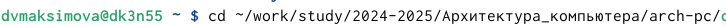
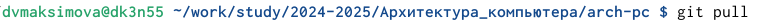
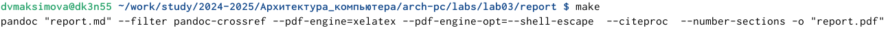
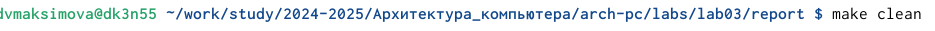
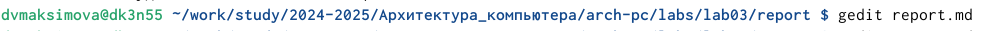

---
## Front matter
title: "Oтчёт по лабораторной работе №3"
subtitle: "Дисциплина: Архитектура компьюьтера"
author: "Максимова Дарья Валерьевна НКАбд-03-24"

## Generic otions
lang: ru-RU
toc-title: "Содержание"

## Bibliography
bibliography: bib/cite.bib
csl: pandoc/csl/gost-r-7-0-5-2008-numeric.csl

## Pdf output format
toc: true # Table of contents
toc-depth: 2
lof: true # List of figures
lot: true # List of tables
fontsize: 12pt
linestretch: 1.5
papersize: a4
documentclass: scrreprt
## I18n polyglossia
polyglossia-lang:
  name: russian
  options:
	- spelling=modern
	- babelshorthands=true
polyglossia-otherlangs:
  name: english
## I18n babel
babel-lang: russian
babel-otherlangs: english
## Fonts
mainfont: IBM Plex Serif
romanfont: IBM Plex Serif
sansfont: IBM Plex Sans
monofont: IBM Plex Mono
mathfont: STIX Two Math
mainfontoptions: Ligatures=Common,Ligatures=TeX,Scale=0.94
romanfontoptions: Ligatures=Common,Ligatures=TeX,Scale=0.94
sansfontoptions: Ligatures=Common,Ligatures=TeX,Scale=MatchLowercase,Scale=0.94
monofontoptions: Scale=MatchLowercase,Scale=0.94,FakeStretch=0.9
mathfontoptions:
## Biblatex
biblatex: true
biblio-style: "gost-numeric"
biblatexoptions:
  - parentracker=true
  - backend=biber
  - hyperref=auto
  - language=auto
  - autolang=other*
  - citestyle=gost-numeric
## Pandoc-crossref LaTeX customization
figureTitle: "Рис."
tableTitle: "Таблица"
listingTitle: "Листинг"
lofTitle: "Список иллюстраций"
lotTitle: "Список таблиц"
lolTitle: "Листинги"
## Misc options
indent: true
header-includes:
  - \usepackage{indentfirst}
  - \usepackage{float} # keep figures where there are in the text
  - \floatplacement{figure}{H} # keep figures where there are in the text
---

# Цель работы

Целью работы является освоение процедуры оформления отчетов с помощью легковесного
языка разметки Markdown.

# Задание

1. Подготовка к выполнению работы.
1. Компиляция шаблона.
1. Задания для самостоятельной работы.

# Выполнение лабораторной работы

* Открываю терминал и перехожу в каталог курса сформированный при выполнении лабораторной работы №2: (рис. [-@fig:001])

{#fig:001 width=70%}

* Обновляю локальный репозиторий, скачав изменения из удаленного репозитория с помощью команды **git pull** (рис. [-@fig:002])

{#fig:002 width=70%}

* Перехожу в каталог с шаблоном отчета по лабораторной работе № 3 и провожу компиляцию шаблона с использованием Makefile. Для этого ввожу команду **make**. При успешной компиляции должны сгенерироваться файлы report.pdf и report.docx. (рис. [-@fig:003]).

{#fig:003 width=70%}

* Удаляю полученный файлы с использованием Makefile. Для этого ввожу команду **make clean** (рис. [-@fig:004]).

{#fig:004 width=70%}

* Открываю файл report.md c помощью любого текстового редактора, например gedit (рис. [-@fig:005]).

{#fig:005 width=70%}

* Затем я заполняю отчет, компилирую его и загружаю на github.

# Выводы

В процессе выполнения лабораторной работы я освоила процедуры оформления отчетов с помощью легковесного языка разметки Markdown, а также загружать файлы на github.

