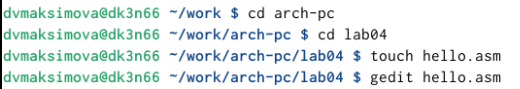
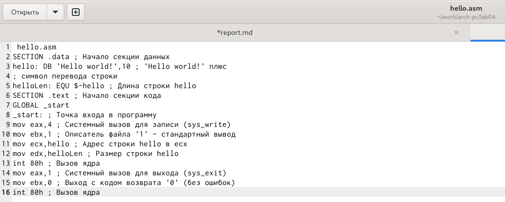
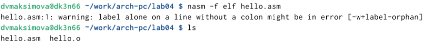
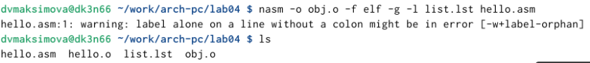
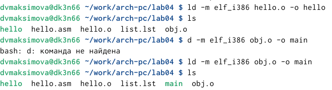
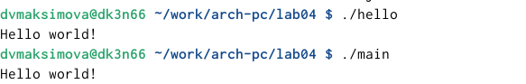
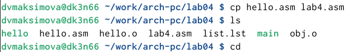
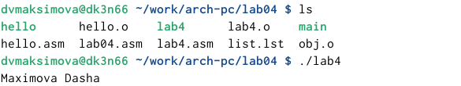
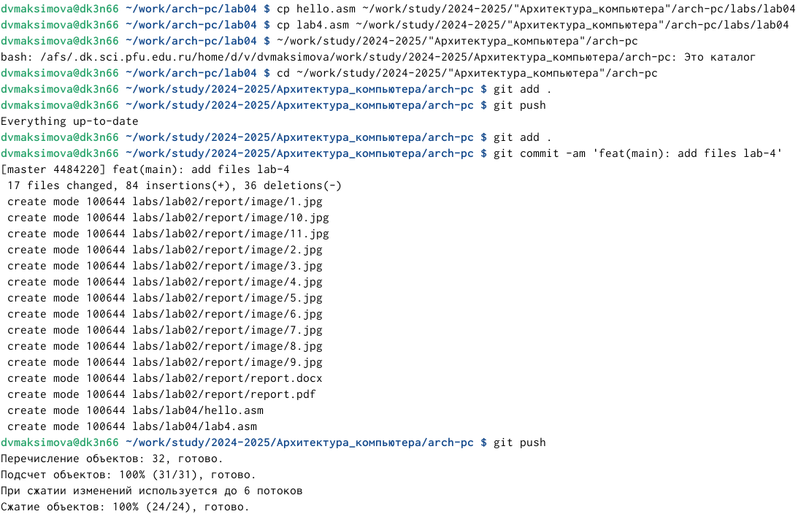

---
## Front matter
title: "Отчёт по лабораторной работе №4"
subtitle: "Дисциплина: Архитектура компьютера"
author: "Максимова Дарья"

## Generic otions
lang: ru-RU
toc-title: "Содержание"

## Bibliography
bibliography: bib/cite.bib
csl: pandoc/csl/gost-r-7-0-5-2008-numeric.csl

## Pdf output format
toc: true # Table of contents
toc-depth: 2
lof: true # List of figures
lot: true # List of tables
fontsize: 12pt
linestretch: 1.5
papersize: a4
documentclass: scrreprt
## I18n polyglossia
polyglossia-lang:
  name: russian
  options:
	- spelling=modern
	- babelshorthands=true
polyglossia-otherlangs:
  name: english
## I18n babel
babel-lang: russian
babel-otherlangs: english
## Fonts
mainfont: IBM Plex Serif
romanfont: IBM Plex Serif
sansfont: IBM Plex Sans
monofont: IBM Plex Mono
mathfont: STIX Two Math
mainfontoptions: Ligatures=Common,Ligatures=TeX,Scale=0.94
romanfontoptions: Ligatures=Common,Ligatures=TeX,Scale=0.94
sansfontoptions: Ligatures=Common,Ligatures=TeX,Scale=MatchLowercase,Scale=0.94
monofontoptions: Scale=MatchLowercase,Scale=0.94,FakeStretch=0.9
mathfontoptions:
## Biblatex
biblatex: true
biblio-style: "gost-numeric"
biblatexoptions:
  - parentracker=true
  - backend=biber
  - hyperref=auto
  - language=auto
  - autolang=other*
  - citestyle=gost-numeric
## Pandoc-crossref LaTeX customization
figureTitle: "Рис."
tableTitle: "Таблица"
listingTitle: "Листинг"
lofTitle: "Список иллюстраций"
lotTitle: "Список таблиц"
lolTitle: "Листинги"
## Misc options
indent: true
header-includes:
  - \usepackage{indentfirst}
  - \usepackage{float} # keep figures where there are in the text
  - \floatplacement{figure}{H} # keep figures where there are in the text
---

# Цель работы

Освоение процедуры компиляции и сборки программ, написанных на ассемблере NASM.

# Задание

1. Программа Hello world!
1. Транслятор NASM
1. Расширенный синтаксис командной строки NASM
1. Компоновщик LD
1. Запуск исполняемого файла
1. Задание для самостоятельной работы

# Выполнение лабораторной работы

### Программа Hello world!

Создаю каталог для работы с программами на языке ассемблера NASM
 
Затем я перехожу в созданный каталог и создаю текстовый файл с именем *Hello.asm* который я открываю с помощью текстового редактора и ввожу текст (рис. [-@fig:001]).

{#fig:001 width=70%}

Ввожу в текстовый файл следующий текст (рис. [-@fig:002])

{#fig:002 width=70%}

### Транслятор NASM

Для компиляции текста выше я ввожу команду, которая преобразует мой текстовый файл в объектный код с именем **hello.o** (рис. [-@fig:003).

{#fig:003 width=70%}

### Расширенный синтаксиc командной строки NASM

Компилирую мой исходный файл hello.asm в объектный файл obj.o , кроме того будет создан файл листинга list.lst (рис. [-@fig:004)

{#fig:004 width=70%}

### Компоновщик LD

Объектный файл необходимо предать на обработку компановщику. Убедиться, что он был создан. Затем ввожу команду для создания исполняемого файла (рис. [-@fig:005).

{#fig:005 width=70%}

### Запуск исполняемого файла

Запустить исполняемый файл с названием "hello" можно с помощью команды ./hello (рис. [-@fig:006).

{#fig:006 width=70%}

## Задание для самостоятельной работы 

Создаю копию файла с именем lab4.asm (рис. [-@fig:007).

{#fig:007 width=70%}

С помощью текстового редактора вношу изменения в мой текстовый файл так, чтоб на экран выводилась моё имя и фамилия. Транслирую текст программы и выполняю компановку объектного файла, запускаю его (рис. [-@fig:008)

{#fig:008 width=70%}

Копирую файлы в мой локальный репозиторий и загружаю всё на github (рис. [-@fig:009)

{#fig:009 width=70%}

# Вывод

В процессе выполнения лабораторной работы я освоила процедуры компиляции и сборки программ, написанных на ассемблере NASM.

