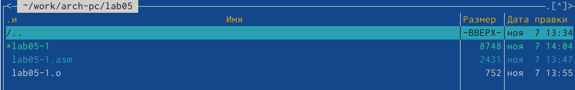

---
## Front matter
title: "Лабораторная работа №5"
subtitle: "Дисциплина: архитектура компьютера"
author: "Максимова Дарья Валерьевна"

## Generic otions
lang: ru-RU
toc-title: "Содержание"

## Bibliography
bibliography: bib/cite.bib
csl: pandoc/csl/gost-r-7-0-5-2008-numeric.csl

## Pdf output format
toc: true # Table of contents
toc-depth: 2
lof: true # List of figures
lot: true # List of tables
fontsize: 12pt
linestretch: 1.5
papersize: a4
documentclass: scrreprt
## I18n polyglossia
polyglossia-lang:
  name: russian
  options:
	- spelling=modern
	- babelshorthands=true
polyglossia-otherlangs:
  name: english
## I18n babel
babel-lang: russian
babel-otherlangs: english
## Fonts
mainfont: IBM Plex Serif
romanfont: IBM Plex Serif
sansfont: IBM Plex Sans
monofont: IBM Plex Mono
mathfont: STIX Two Math
mainfontoptions: Ligatures=Common,Ligatures=TeX,Scale=0.94
romanfontoptions: Ligatures=Common,Ligatures=TeX,Scale=0.94
sansfontoptions: Ligatures=Common,Ligatures=TeX,Scale=MatchLowercase,Scale=0.94
monofontoptions: Scale=MatchLowercase,Scale=0.94,FakeStretch=0.9
mathfontoptions:
## Biblatex
biblatex: true
biblio-style: "gost-numeric"
biblatexoptions:
  - parentracker=true
  - backend=biber
  - hyperref=auto
  - language=auto
  - autolang=other*
  - citestyle=gost-numeric
## Pandoc-crossref LaTeX customization
figureTitle: "Рис."
tableTitle: "Таблица"
listingTitle: "Листинг"
lofTitle: "Список иллюстраций"
lotTitle: "Список таблиц"
lolTitle: "Листинги"
## Misc options
indent: true
header-includes:
  - \usepackage{indentfirst}
  - \usepackage{float} # keep figures where there are in the text
  - \floatplacement{figure}{H} # keep figures where there are in the text
---

# Цель работы

Приобретение практических навыков работы в Midnight Commander. Освоение инструкций языка ассемблера mov и in.

# Задание

1. Работа в Midnight Commander.
1. Подключение внешнего файла in_out.asm.
1. Задание для самостоятельной работы.

# Теоретическое введение

# Выполнение лабораторной работы

*Открываю Midniht Commander. В каталоге созданном при выполнении лаб. работы №4 и там создаю папку lab05 (рис. [-@fig:001]).

{#fig:001 width=70%}

*Создаю файл lab05-1.asm; Затем я открываю файл для редактирования во встроенном редакторе и ввожу текст программы из листинга 5.1, сохраняю изменения и закрываю файл (рис. [-@fig:002]).

{#fig:002 width=70%}

*С помощью функциональной клавиши F3 открываю мой файл для просмотра. Убеждаюсь, что текст программы правильный. (рис. [-@fig:003]).

{#fig:003 width=70%}

*Транслирую текст программы lab05-1.asm в обьектный файл (рис. [-@fig:004]).

{#fig:004 width=70%}

*Созданный мной исполняемый файл: (рис. [-@fig:005]).

{#fig:005 width=70%}

*После запуска мой исполняемый файл работает, он ожидает ввода с клавиатуры. Я ввожу своё ФИО(рис. [-@fig:006]).

{#fig:006 width=70%}

### Подключение внешнего файла in_out.asm

*Скачиваю нужный файл для выполнения лаб. работы из туиса, обращаю внимание на то, что скачанный файл должен находится в том же каталоге, что и файл с программой (рис. [-@fig:007]).

{#fig:007 width=70%}

*При помощи f6 я создаю копию файла lab05-1.asm с именем lab05-2.asm (рис. [-@fig:008]).

{#fig:008 width=70%}

*Я исправляю текст программы в соответствии с листингом 5.2, затем создаю исполняемый файл и проверяю его работу(похожие действия мы уже проделывали в предыдущих подпунктах) (рис. [-@fig:009]).

{#fig:009 width=70%}

*В файле lab05-2.asm мне нужно внести изменения в программму. После всех изменений я проверяю исполняемый файл на работу. Отличие в том, что теперь ввод с клавиатуры происходит не на следующей строчке, а на этой же. (рис. [-@fig:010]).

{#fig:010 width=70%}

### Задание для самостоятельной работы 

*Создаю копию файла lab05-1.asm и вношу изменения в программу, так чтоб она работала по алгоритму и вывордила введеную строку на экран. Получаю исполняемый файл и проверяю его работу (рис. [-@fig:011]).

{#fig:011 width=70%}

*Создаю копию файла lab05-2.asm и исправляю текст с использованием программ из внешнего файла так, чтоб она опять таки выводила введеную команду на экран. Остается проверить работу программы: (рис. [-@fig:012]).

{#fig:012 width=70%}

# Выводы

Я приобрела практические навыки работы в Midnight Commander. Освоила инструкции языка ассемблера mov и in. Я считаю, что приобретенные навыки во многом помогут мне при программировании.

# Список литературы{.unnumbered}

::: {#refs}
:::
