---
## Front matter
title: "Отчет по лабораторной работе №6"
subtitle: "Дисциплина: Архитектура компьюьтера"
author: "Максимова Дарья Валерьевна"

## Generic otions
lang: ru-RU
toc-title: "Содержание"

## Bibliography
bibliography: bib/cite.bib
csl: pandoc/csl/gost-r-7-0-5-2008-numeric.csl

## Pdf output format
toc: true # Table of contents
toc-depth: 2
lof: true # List of figures
lot: true # List of tables
fontsize: 12pt
linestretch: 1.5
papersize: a4
documentclass: scrreprt
## I18n polyglossia
polyglossia-lang:
  name: russian
  options:
	- spelling=modern
	- babelshorthands=true
polyglossia-otherlangs:
  name: english
## I18n babel
babel-lang: russian
babel-otherlangs: english
## Fonts
mainfont: IBM Plex Serif
romanfont: IBM Plex Serif
sansfont: IBM Plex Sans
monofont: IBM Plex Mono
mathfont: STIX Two Math
mainfontoptions: Ligatures=Common,Ligatures=TeX,Scale=0.94
romanfontoptions: Ligatures=Common,Ligatures=TeX,Scale=0.94
sansfontoptions: Ligatures=Common,Ligatures=TeX,Scale=MatchLowercase,Scale=0.94
monofontoptions: Scale=MatchLowercase,Scale=0.94,FakeStretch=0.9
mathfontoptions:
## Biblatex
biblatex: true
biblio-style: "gost-numeric"
biblatexoptions:
  - parentracker=true
  - backend=biber
  - hyperref=auto
  - language=auto
  - autolang=other*
  - citestyle=gost-numeric
## Pandoc-crossref LaTeX customization
figureTitle: "Рис."
tableTitle: "Таблица"
listingTitle: "Листинг"
lofTitle: "Список иллюстраций"
lotTitle: "Список таблиц"
lolTitle: "Листинги"
## Misc options
indent: true
header-includes:
  - \usepackage{indentfirst}
  - \usepackage{float} # keep figures where there are in the text
  - \floatplacement{figure}{H} # keep figures where there are in the text
---

# Цель работы

Освоение арифмитических инстуркций языка ассемблера NASM.

# Задание

1. Символьные и численные данные в NASM
1. Выполнение арифметических операций в NASM
1. Ответы на вопросы
1. Задание для самостоятельной работы

# Выполнение лабораторной работы

## Символьные и численные данные в NASM

Создаю каталог для программам лабораторной работы № 6, затем перехожу в него и создайте файл lab6-1.asm: (рис. [-@fig:001]).

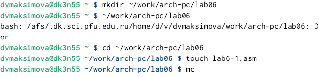{#fig:001 width=70%}

Ввожу в этот файл текст из листинга 6.1 и вывожу результат. Создаю исполняемый файл и запускаю его, вот какой результат у меня получился (рис. [-@fig:002]).

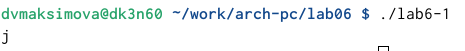{#fig:002 width=70%}

В результате вывело символ j. Несмторя на то, что мы ожидали увидеть число 10

Далее я изменяю текст программы и вместо символов записываю в регистры числа. (рис. [-@fig:003]).

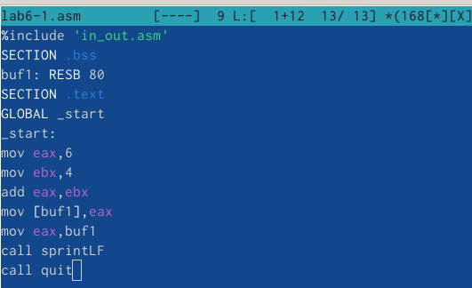{#fig:003 width=70%}

В результате получается снова не число, вывелся символ с кодом 10. Используя таблицу ASCII я определила, что на выводе мы получили пустой символ, которому как раз таки соответсувуте число 10 в таблице(рис. [-@fig:004]).

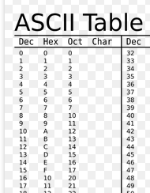{#fig:004 width=70%}

Теперь создаю файл lab6-2.asm (рис. [-@fig:005]).

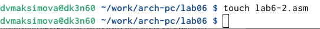{#fig:005 width=70%}

Ввожу туда текст с листинга 6.2. Затем запускаю программу и получаю результат в виде числа 106(рис. [-@fig:006]).

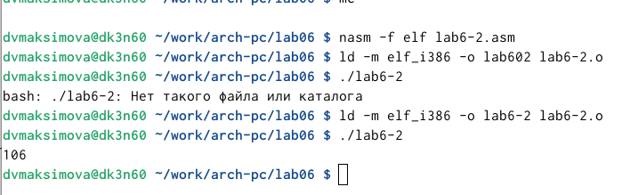{#fig:006 width=70%}

По аналогии с прошлым примером я изменяю текст программы, заменяя симвлы на числа, и в таком случае в резутате я получу число 10 (рис. [-@fig:007]).

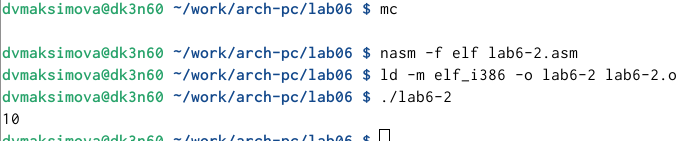{#fig:007 width=70%}

А если я изменю фунукцию iprintLF на iprint, то тогда командная строчка будет на той же строке, что и вывод (рис. [-@fig:008]).

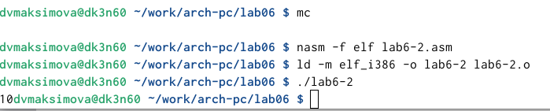{#fig:008 width=70%} 

## Выполнение арифметических операций в NASM

Я создаю новый файл lab6-3.asm для работы с листингом 6.3, который я соответственно ввожу в этот файл (рис. [-@fig:009]).

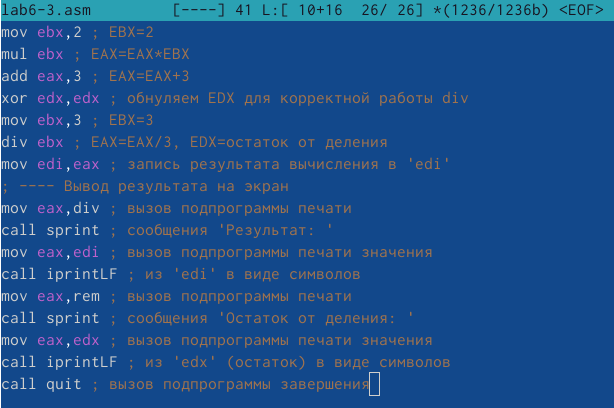{#fig:009 width=70%}

Заметим, что вот такой результат выдает нам программа (рис. [-@fig:010]).

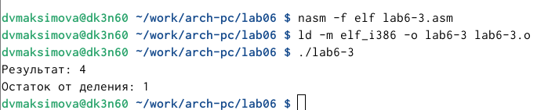{#fig:010 width=70%}

В соответствии с заданием я изменяю текст программы для вычисления выражения f(x)=(4*6+2)/5 (рис. [-@fig:011]).

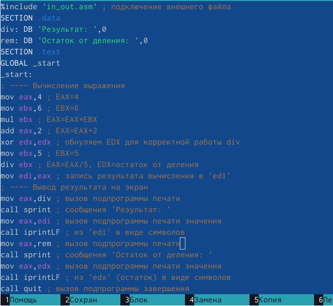{#fig:011 width=70%}

Проверяю его работу. (рис. [-@fig:012]).

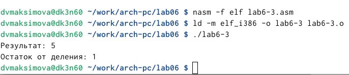{#fig:012 width=70%}

Для выполнения следующего этапа лабораторной работы, я создаю файл variant.asm и ввожу текст из листинга 6.4, который вычисляет вариант задания по номеру студенеского билета (рис. [-@fig:013]).

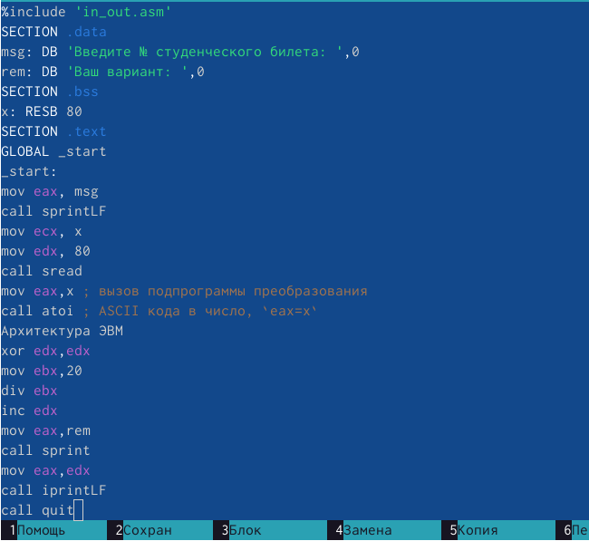{#fig:013 width=70%}
 
Вычисляю свой номер варианта (рис. [-@fig:014]).

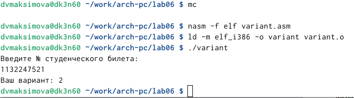{#fig:014 width=70%}

## Ответы на вопросы 

1. В листинге 6.4 за вывод сообщения отвечают строчки

mov eax,rem

call sprint

2. первая инструкция mov ecx, x используется, чтобы положить адрес вводимой строки x в регистр . а строчка ecx mov edx, 80 - записывает в регистр edx длины вводимой строки . ну и строчка call sread - вызывает подпрограмму из внешнего файла, обеспечивающей ввод сообщения с клавиатуры
 
3. инструкция call atoi используется в случае, когда надо преобразовать символы в целые числа

4. За вычисления варианта в листинге 6.4 отвечают следующие строчки:

xor edx,edx ; обнуление edx для корректной работы div

mov ebx,20 ; ebx = 20

div ebx ; eax = eax/20, edx - остаток от деления

inc edx ; edx = edx + 1

5. При выполнении инструкции "div ebx" остаток от деления записывается в регистр edx.

6.  Инструкция "inc edx" используется для увеличения значения регистра на 1

7. За вывод на экран результата отвечают эти строчки:

mov eax,edx

call iprintLF 

## Задание для самостоятельной работы

Мне необходимо написать программу, которая выводит на экран выражения для вычисления, а также выводить результат вычислений, при этом программа сама должна посчитать заданное выражение в зависимости от введенных мной переменных. Я буду выполнять задание в соответствии с вариантом №2 , который я вычислила в ходе лабораторной работы. (рис. [-@fig:015]).

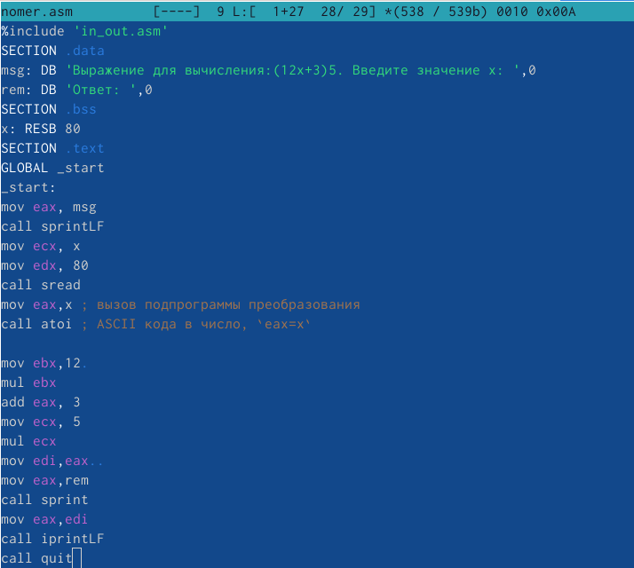{#fig:015 width=70%}

После создания исполняемого файла, я ввожу переменные такие, как в таблице 6.3 и проверяю как работает программа (рис. [-@fig:016]).

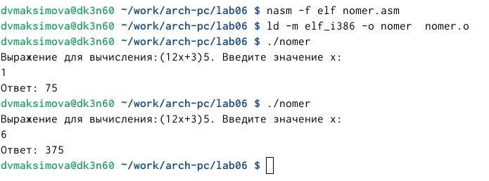{#fig:016 width=70%}

Программа работает успешно!

# Выводы

Я освоила арифмитические инстуркции языка ассемблера NASM.
