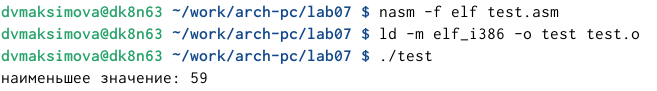

---
## Front matter
title: "Отчёт по лабораторной работе №7"
subtitle: "Дисциплина: Архитектура компьютера"
author: "Максимова Дарья Валерьевна"

## Generic otions
lang: ru-RU
toc-title: "Содержание"

## Bibliography
bibliography: bib/cite.bib
csl: pandoc/csl/gost-r-7-0-5-2008-numeric.csl

## Pdf output format
toc: true # Table of contents
toc-depth: 2
lof: true # List of figures
lot: true # List of tables
fontsize: 12pt
linestretch: 1.5
papersize: a4
documentclass: scrreprt
## I18n polyglossia
polyglossia-lang:
  name: russian
  options:
	- spelling=modern
	- babelshorthands=true
polyglossia-otherlangs:
  name: english
## I18n babel
babel-lang: russian
babel-otherlangs: english
## Fonts
mainfont: IBM Plex Serif
romanfont: IBM Plex Serif
sansfont: IBM Plex Sans
monofont: IBM Plex Mono
mathfont: STIX Two Math
mainfontoptions: Ligatures=Common,Ligatures=TeX,Scale=0.94
romanfontoptions: Ligatures=Common,Ligatures=TeX,Scale=0.94
sansfontoptions: Ligatures=Common,Ligatures=TeX,Scale=MatchLowercase,Scale=0.94
monofontoptions: Scale=MatchLowercase,Scale=0.94,FakeStretch=0.9
mathfontoptions:
## Biblatex
biblatex: true
biblio-style: "gost-numeric"
biblatexoptions:
  - parentracker=true
  - backend=biber
  - hyperref=auto
  - language=auto
  - autolang=other*
  - citestyle=gost-numeric
## Pandoc-crossref LaTeX customization
figureTitle: "Рис."
tableTitle: "Таблица"
listingTitle: "Листинг"
lofTitle: "Список иллюстраций"
lotTitle: "Список таблиц"
lolTitle: "Листинги"
## Misc options
indent: true
header-includes:
  - \usepackage{indentfirst}
  - \usepackage{float} # keep figures where there are in the text
  - \floatplacement{figure}{H} # keep figures where there are in the text
---

# Цель работы

Изучение команд условного и безусловного переходов. Приобретение навыков написания
программ с использованием переходов. Знакомство с назначением и структурой файла
листинга.

# Задание

1.Реализация переходов в NASM
1.Изучение структуры файлы листинга
1.Задание для самостоятельной работы
1.задание№1
1.задание№2

# Теоретическое введение

Для реализации ветвлений в ассемблере используются так называемые команды передачи
управления или команды перехода. Можно выделить 2 типа переходов:
• условный переход – выполнение или не выполнение перехода в определенную точку
программы в зависимости от проверки условия.
• безусловный переход – выполнение передачи управления в определенную точку про-
граммы без каких-либо условий.

# Выполнение лабораторной работы

## Реализация переходов в NASM

Создаю каталог для выполнения лабораторной работы, прехожу в него и там создаю файл lab7-1.asm
Затем ввожу в этот файл текст с листинга 7.1 (рис. [-@fig:001]).

{#fig:001 width=70%}

Создаю исполняемый файл и запускаю его результат программы получился вот таким (рис. [-@fig:003]).

{#fig:003 width=70%}

В соответствии с листингом 7.2 я редактирую текст программы и теперь программа выводит на экран сначала строчку "Сообщение №2", а затем строчку "Сообщение№1" и завершает работу: (рис. [-@fig:004]).

{#fig:004 width=70%}

Затем я самостоятельно редактирую тест программы: (рис. [-@fig:005]).

{#fig:005 width=70%}

После редактирования программы вывод на экран получается таким(рис. [-@fig:006]).

{#fig:006 width=70%}

Для следующего задания я создаю файл lab7-2.asm и ввожу текст из листинга 7.3(рис. [-@fig:007]).

{#fig:007 width=70%}

И проверяю программу, вводя разные переменные B, которые у меня запрашивает проограмма(рис. [-@fig:008]).

{#fig:008 width=70%}

## Изучение структуры файлы листинга

Для того, чтобы получить файл листинга я указываю ключ -l и задаю имя файла листинга в командной строке. Пользуясь этим, создаю файл листинга моего файла lab7-2.asm(рис. [-@fig:009]).

{#fig:009 width=70%}

Открываю файл листинга, который выглядит следующим образом:(рис. [-@fig:010]).

{#fig:010 width=70%}

Комментируя данные строчки, могу утверждать, что первая строчка отвечает за перемещение символа B в переменную eax, второй строчкой мы вызываем попрограмму atoi, которая в свою очередь переводит символ в число, и третья строчка выполняет премещение eax в пременную "B". Таким образом, введя в программу три эти строчки, мы преобразорвали символ в число, которое теперь находится в "B".(рис. [-@fig:011]).

{#fig:011 width=70%}

Я открываю файл lab7-2.asm и редактирую так, что в любой инструкции удаляю один из двух операндов (рис. [-@fig:012]).

{#fig:012 width=70%}

редактирую(рис. [-@fig:013]).

{#fig:013 width=70%}

Вот что получаю, когда хочу сделать файл листинга(рис. [-@fig:014]).

{#fig:014 width=70%}

## Задание для самостоятельной работы

При выполнении лабораторной работы №6 у меня был второй вариант, поэтому при выполнении заданий я буду использовать значения переменных соответственные второму варианту. 

## задание№1

В том же каталоге, где я выполняла свою лабораторную работу, я создаю файл для выполнения задания с именем test.asm(рис. [-@fig:015]).

{#fig:015 width=70%}

Затем пишу программу, которая найдет неименьшую целочисленную переменную из a,b и c(рис. [-@fig:001]).

{#fig:016 width=70%}

Создаю исполняемый файл и запускаю. Всё работает правильно, поэтому перехожу к выполнению второго задания (рис. [-@fig:017]).

{#fig:017 width=70%}

## задание№2

Создаю файл test2.asm, в который самостоятельно записываю программу для выполнения задания(рис. [-@fig:018]).

{#fig:018 width=70%}

Создаю исполняемый файл, запускаю его, ввожу переменные и проверяю работу для введеных мной значений из таблицы 7.6(рис. [-@fig:019]).

{#fig:019 width=70%}

# Выводы

Я изучила команды условного и безусловного переходов. Приобрела навыки написания
программ с использованием переходов. и Знакомство с назначением и структурой файла
листинга.

