---
## Front matter
title: "Отчёт по лабораторной работе №8"
subtitle: "Дисциплина: Архитектура компьютера"
author: "Максимова Дарья Валерьевна"

## Generic otions
lang: ru-RU
toc-title: "Содержание"

## Bibliography
bibliography: bib/cite.bib
csl: pandoc/csl/gost-r-7-0-5-2008-numeric.csl

## Pdf output format
toc: true # Table of contents
toc-depth: 2
lof: true # List of figures
lot: true # List of tables
fontsize: 12pt
linestretch: 1.5
papersize: a4
documentclass: scrreprt
## I18n polyglossia
polyglossia-lang:
  name: russian
  options:
	- spelling=modern
	- babelshorthands=true
polyglossia-otherlangs:
  name: english
## I18n babel
babel-lang: russian
babel-otherlangs: english
## Fonts
mainfont: IBM Plex Serif
romanfont: IBM Plex Serif
sansfont: IBM Plex Sans
monofont: IBM Plex Mono
mathfont: STIX Two Math
mainfontoptions: Ligatures=Common,Ligatures=TeX,Scale=0.94
romanfontoptions: Ligatures=Common,Ligatures=TeX,Scale=0.94
sansfontoptions: Ligatures=Common,Ligatures=TeX,Scale=MatchLowercase,Scale=0.94
monofontoptions: Scale=MatchLowercase,Scale=0.94,FakeStretch=0.9
mathfontoptions:
## Biblatex
biblatex: true
biblio-style: "gost-numeric"
biblatexoptions:
  - parentracker=true
  - backend=biber
  - hyperref=auto
  - language=auto
  - autolang=other*
  - citestyle=gost-numeric
## Pandoc-crossref LaTeX customization
figureTitle: "Рис."
tableTitle: "Таблица"
listingTitle: "Листинг"
lofTitle: "Список иллюстраций"
lotTitle: "Список таблиц"
lolTitle: "Листинги"
## Misc options
indent: true
header-includes:
  - \usepackage{indentfirst}
  - \usepackage{float} # keep figures where there are in the text
  - \floatplacement{figure}{H} # keep figures where there are in the text
---

# Цель работы

Приобретение навыков написания программ с использованием циклов и обработкой аргументов командной строки.

# Задание

1. Реализация циклов в NASM
1. Обработка аргументов командной строки
1. Задание для самостоятельной работы
 
# Выполнение лабораторной работы

Для начала создаю каталог для выполнения лаб. работы и в нем создаю файл lab08-1.asm. Далее ввожу в этот файл текст из листинга 8.1: (рис. [-@fig:001]).

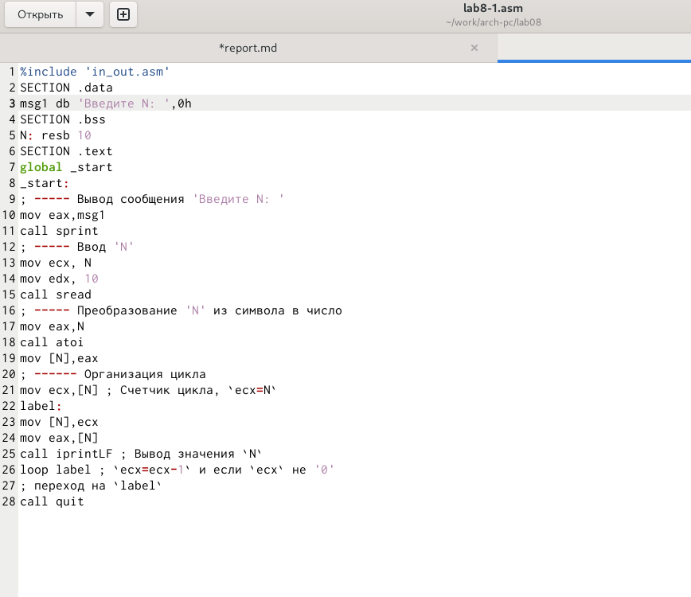{#fig:001 width=70%}

Вот как работает эта программа: (рис. [-@fig:002]).

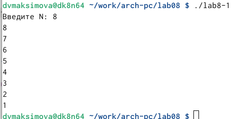{#fig:002 width=70%}

Добавляю измения в текст программы согласно методическим материалам (рис. [-@fig:003]).

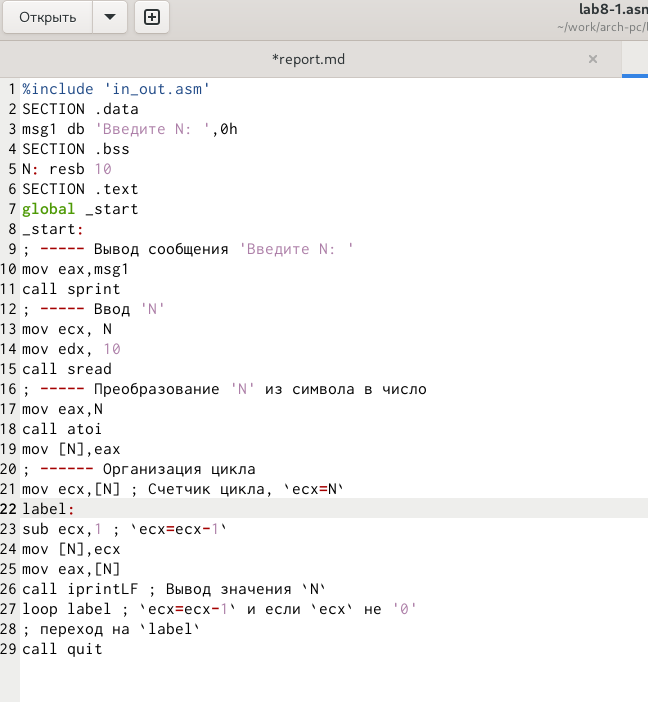{#fig:003 width=70%}

Вот такой пугающий результат работы программы(рис. [-@fig:004]).

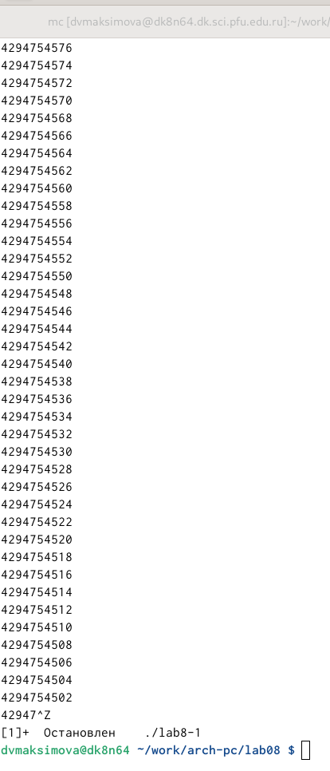{#fig:004 width=70%}

Как мы видим, программа выводит огромное количество чисел, и, таким образом число проходов цикла гораздо больше чем введенное N.

Я вношу изменения в программую. добавляя команды push и pop. Запускаю программу и теперь все стало нормально. Количество проходов цикла соответствует введенному мной N(рис. [-@fig:005]).

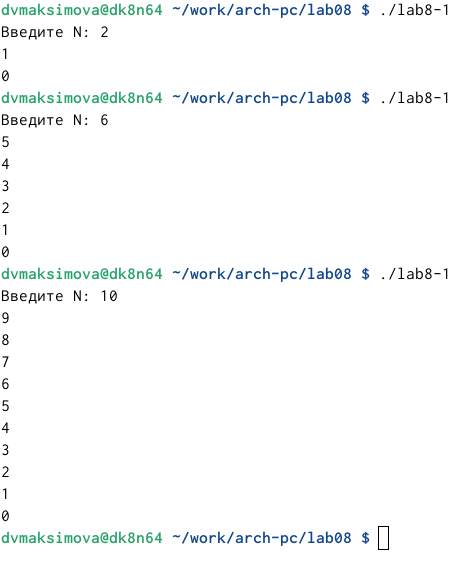{#fig:005 width=70%}

## Обработка аргументов командной строки

Создаю новый файл и ввожу в него текст листинга 8.2 (рис. [-@fig:006]).

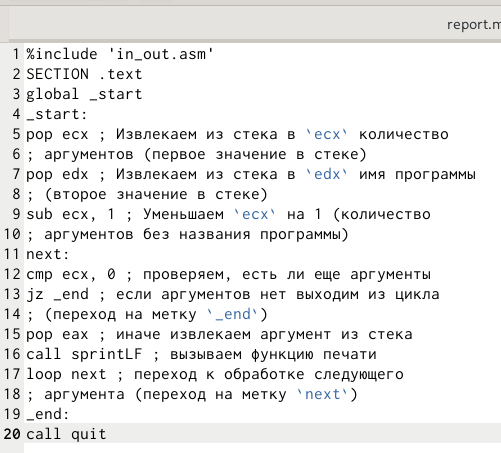{#fig:006 width=70%}

Запускаю файл в работу, указав аргументы (рис. [-@fig:007]).

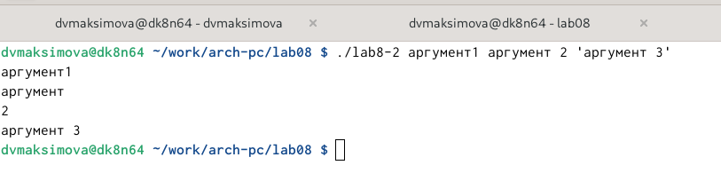{#fig:007 width=70%}

Можно сказать, что программой было обработано 4 аргумента.

Для рассмотрения следующего примера я создаю новый файл и ввожу туда текст листинга 8.3(рис. [-@fig:008]).

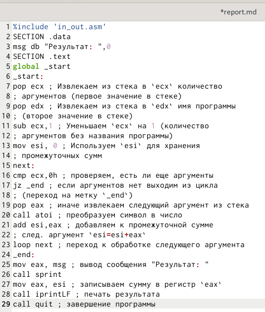{#fig:008 width=70%}

Результат работы получился соответветствующим (рис. [-@fig:009]).

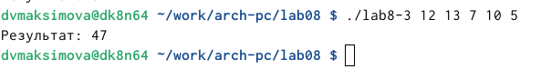{#fig:009 width=70%}

Теперь нам нужно изменить текст программы под аргументы(рис. [-@fig:010]).

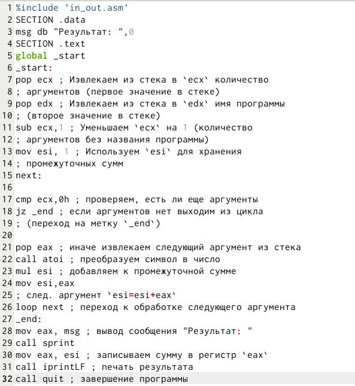{#fig:010 width=70%}

Как видим текст программы изменен успешно и у нас все работает (рис. [-@fig:011]).

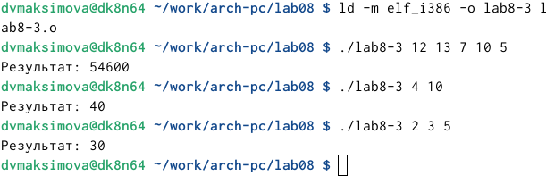{#fig:011 width=70%}

## Задание для самостоятельной работы

Для выполнения самостоятельного задания я создам файл nomer.asm в том же каталоге, где выполняла предыдущие задания. 
Суть задания заключается в том, что я должна самостоятельно написать такую программу, которя будет выводить сумму значений функций исходя из того, какие переменные я буду вводить в программу (как аргументы). При выолнении лабораторной работы №7, я выполнянла задания для 2 варианта, соответственно при выполнении этой лабораторной работы. я тоже буду выполнять 2 вариант. 
 
Самостоятельно пишу код для того, чтоб программа успешно работала:(рис. [-@fig:012]).

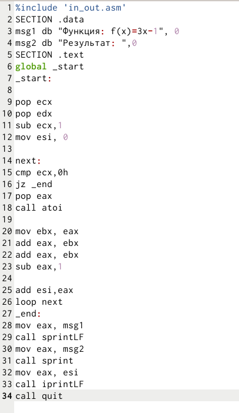{#fig:012 width=70%}

Послек долгих попыток написать правильный код, я к этому пришла.
Вот таким образом работает моя программа:(рис. [-@fig:013]).

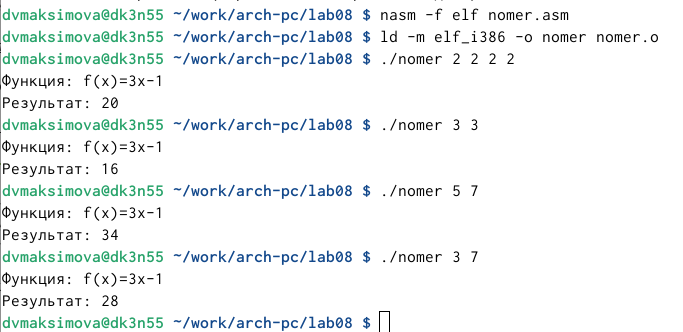{#fig:013 width=70%}

# Выводы

Я приобрела навыки написания программ с использованием циклов и навыки обработки аргументов командной строки.

