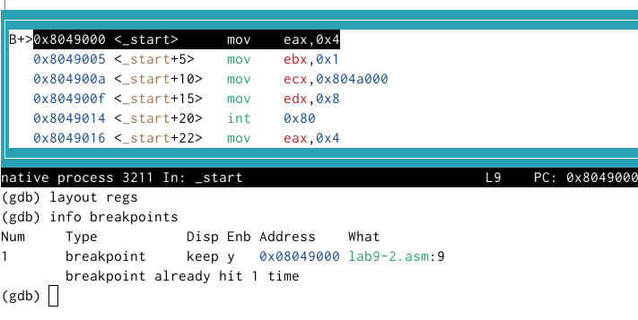

---
## Front matter
title: "Отчётпо лабораторной работе №9"
subtitle: "Дисциплина: Архитектура компьютера"
author: "Максимова Дарья Валерьевна"

## Generic otions
lang: ru-RU
toc-title: "Содержание"

## Bibliography
bibliography: bib/cite.bib
csl: pandoc/csl/gost-r-7-0-5-2008-numeric.csl

## Pdf output format
toc: true # Table of contents
toc-depth: 2
lof: true # List of figures
lot: true # List of tables
fontsize: 12pt
linestretch: 1.5
papersize: a4
documentclass: scrreprt
## I18n polyglossia
polyglossia-lang:
  name: russian
  options:
	- spelling=modern
	- babelshorthands=true
polyglossia-otherlangs:
  name: english
## I18n babel
babel-lang: russian
babel-otherlangs: english
## Fonts
mainfont: IBM Plex Serif
romanfont: IBM Plex Serif
sansfont: IBM Plex Sans
monofont: IBM Plex Mono
mathfont: STIX Two Math
mainfontoptions: Ligatures=Common,Ligatures=TeX,Scale=0.94
romanfontoptions: Ligatures=Common,Ligatures=TeX,Scale=0.94
sansfontoptions: Ligatures=Common,Ligatures=TeX,Scale=MatchLowercase,Scale=0.94
monofontoptions: Scale=MatchLowercase,Scale=0.94,FakeStretch=0.9
mathfontoptions:
## Biblatex
biblatex: true
biblio-style: "gost-numeric"
biblatexoptions:
  - parentracker=true
  - backend=biber
  - hyperref=auto
  - language=auto
  - autolang=other*
  - citestyle=gost-numeric
## Pandoc-crossref LaTeX customization
figureTitle: "Рис."
tableTitle: "Таблица"
listingTitle: "Листинг"
lofTitle: "Список иллюстраций"
lotTitle: "Список таблиц"
lolTitle: "Листинги"
## Misc options
indent: true
header-includes:
  - \usepackage{indentfirst}
  - \usepackage{float} # keep figures where there are in the text
  - \floatplacement{figure}{H} # keep figures where there are in the text
---

# Цель работы

Приобретение навыков написания программ с использованием подпрограмм. Знакомство с методами отладки при помощи GDB и его основными возможностями.
 
# Задание

1. Реализация подпрограмм в NASM
1. Отладка программам с помощью GDB
1. Добавление точек останова
1. Работа с данными программы в GDB
1. Обработка аргументов командной строки в GDB
1. Задание для самостоятельной работы

# Выполнение лабораторной работы

## Реализация подпрограмм в NASM

По аналогии с предыдущими лабораторными работами, файлы asm я буду создавать в каталоге "work/arch-pc". В файле lab9-1.asm вписываю программу из листинга 9.1, которую я внимательно изучила. Создаю исполняемый файл и запускаю его в работу. (рис. [-@fig:001]).

{#fig:001 width=70%}

После этого я переписываю программу согласно методическому материалу (рис. [-@fig:002]).

{#fig:002 width=70%}

Создаю исполняемый файл и убеждаюсь в том, что все работает успешно.(рис. [-@fig:003]).

{#fig:003 width=70%}

## Отладка программам с помощью GDB

В новом файле lab9-2.asm записываю текст программы из листинга 9.2. Для работы с GDB в исполняемый файл необходимо добавить отладочную информацию, для этого трансляцию программ провожу с ключом ‘-g’. И загружаю файл в откладчик gbd, а затем проверяю выполнение программы с помощью команды run (рис. [-@fig:004]).

{#fig:004 width=70%}

Для более подробного анализа программы устанавливаю брейкпоинт на метку _start, с которой начинается выполнение любой ассемблерной программы, и запускаю её. (рис. [-@fig:005]).

{#fig:005 width=70%}

Просматриваю дисассимилированный код программы с помощью команды disassemble начиная с метки _start (рис. [-@fig:006]).

{#fig:006 width=70%}

Переключаюсь на отображение команд с Intel’овским синтаксисом, введя команду set disassembly-flavor intel  (рис. [-@fig:007]).

{#fig:007 width=70%}

Есть некоторые различия в отображениях в этих режимах, а именно в виде колонки с текстом программы: в Intel'e она выглядит, как *"$0x{операнд},%{регистер}"*, а в ATT - *"{регистер},0х{операнд}"*

Включаю режим псевдографики для удобного анализа программ  (рис. [-@fig:008]).

{#fig:008 width=70%}

## Добавление точек останова

На предыдущих шагах была установлена точка останова по имени метки (_start). Проверяю это с помощью команды info breakpoints (рис. [-@fig:009]).

{#fig:009 width=70%}

Я установила еще одну точку останова по адресу инструкции, и теперь когда мы запрашиваем информацию о брейкпоинтах, нам показываются две точки останова: (рис. [-@fig:010]).

{#fig:010 width=70%}

## Работа с данными программы в GDB

Для того, что бы посмотреть значения регистров можно воспользоваться командой "i r". Вот какие значения регистров вывелись  (рис. [-@fig:011]).

{#fig:011 width=70%}

С помощью команды x &<имя переменной> также можно посмотреть содержимое переменной. Я посмотрела значение переменной msg1 по имени и вот результат. (рис. [-@fig:012]).

{#fig:012 width=70%}

Аналогично можно посмотреть значение переменной msg2 по адресу. (рис. [-@fig:013]).

{#fig:013 width=70%}

Теперь я изменяю первый символ переменной msg1 (рис. [-@fig:014]).

{#fig:014 width=70%}

А также я изменила разные символы в переменной msg2  (рис. [-@fig:015]).

{#fig:015 width=70%}

Теперь изменим значение регистра ebx:  (рис. [-@fig:016]).

{#fig:016 width=70%}

Команда set позволяе изменить значение регистра, проделываем это  с регистром ebx, и использую команду p/s, чтоб промотреть значение.

## Обработка аргументов командной строки в GDB

Создаю исполняемый файл из файла, с которым я работала в процессе выполнения лбораторной работы №8. 

А затем загружаю данный файл в отладчик, предварительно указав ключ к работе с аргументами, и указываю эти самые аргументы  (рис. [-@fig:017]).

{#fig:017 width=70%}

Для начала устанавливаем первую точку останова, а затем запускаем программу (рис. [-@fig:018]).

{#fig:018 width=70%}

На данном этапе, мы можем просмотреть позиции стека отдельно по адресам  (рис. [-@fig:019]).

{#fig:019 width=70%}

## Задание для самостоятельной работы

Переходим к выполнению заданий самостоятельного характера.

№1

Я преобразовываю программу , с которой я работала в процесее 8 лабораторной работы. Я должна реализовать вычисление функции в подпрограмме (до этого вычисления были в основной программе).

Вот таким образом выглядит код программы:  (рис. [-@fig:020]).

{#fig:020 width=70%}

Теперь проверим как работает программа:  (рис. [-@fig:021]).

{#fig:021 width=70%}

№2 

При запуске программа вычисления выражения (3 + 2) ∗ 4 + 5 дает неверный результат. Программа должна выводить 25, а выводит в ответе 10.(рис. [-@fig:022]).

{#fig:022 width=70%}

Моя задача - определить ошибку с помощью отладчика. Ошибка заключается в том, что регистр eax был умножен на 4, хотя для правильности нам надо было умножать ebx

Саомстоятельно постараюсь исправить код. Вот так выглядит код с внесением моих изменений (рис. [-@fig:023]).

{#fig:023 width=70%}

Теперь я проверяю работу кода, и радуюсь, что все нормально работает!!!:) (рис. [-@fig:024]).

{#fig:024 width=70%}

# Выводы

Я приобрела навыки написания программ с использованием подпрограмм, познакомилась с методами отладки при помощи GDB и его основными возможностями.
