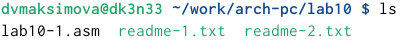
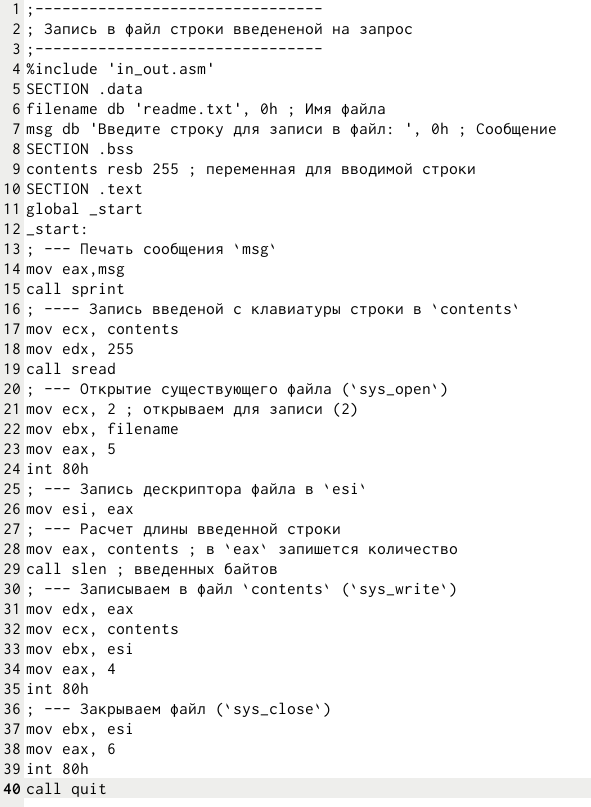
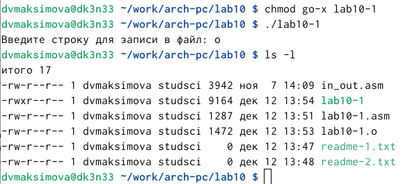
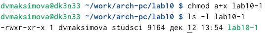
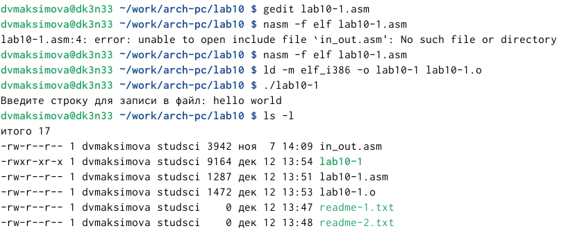
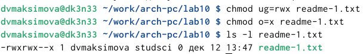
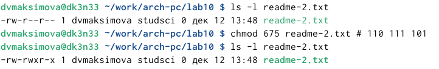
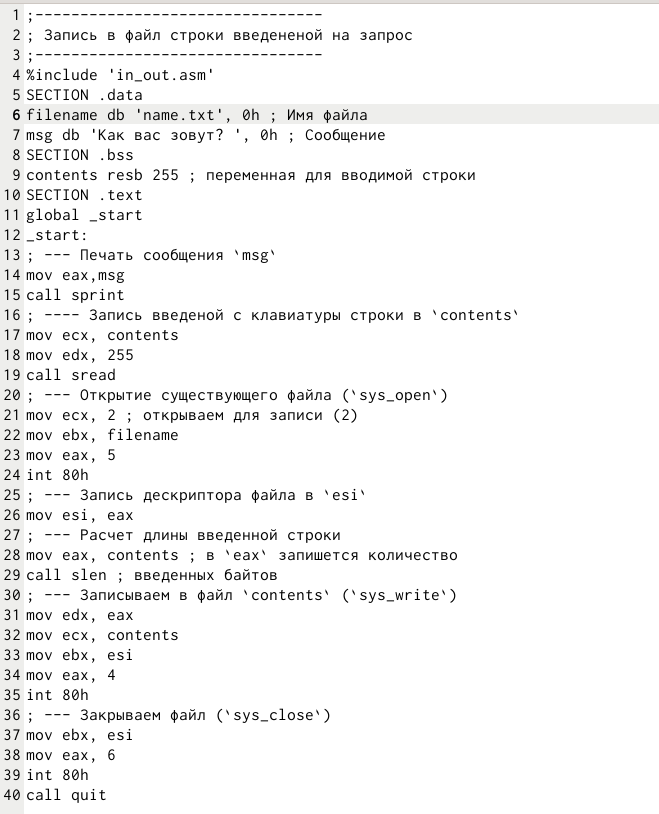
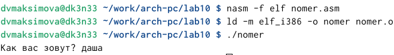

---
## Front matter
title: "Отчёт по лабораторной работе №10"
subtitle: "Дисциплина: Архитектура компьютера"
author: "Максимова Дарья Валерьевна"

## Generic otions
lang: ru-RU
toc-title: "Содержание"

## Bibliography
bibliography: bib/cite.bib
csl: pandoc/csl/gost-r-7-0-5-2008-numeric.csl

## Pdf output format
toc: true # Table of contents
toc-depth: 2
lof: true # List of figures
lot: true # List of tables
fontsize: 12pt
linestretch: 1.5
papersize: a4
documentclass: scrreprt
## I18n polyglossia
polyglossia-lang:
  name: russian
  options:
	- spelling=modern
	- babelshorthands=true
polyglossia-otherlangs:
  name: english
## I18n babel
babel-lang: russian
babel-otherlangs: english
## Fonts
mainfont: IBM Plex Serif
romanfont: IBM Plex Serif
sansfont: IBM Plex Sans
monofont: IBM Plex Mono
mathfont: STIX Two Math
mainfontoptions: Ligatures=Common,Ligatures=TeX,Scale=0.94
romanfontoptions: Ligatures=Common,Ligatures=TeX,Scale=0.94
sansfontoptions: Ligatures=Common,Ligatures=TeX,Scale=MatchLowercase,Scale=0.94
monofontoptions: Scale=MatchLowercase,Scale=0.94,FakeStretch=0.9
mathfontoptions:
## Biblatex
biblatex: true
biblio-style: "gost-numeric"
biblatexoptions:
  - parentracker=true
  - backend=biber
  - hyperref=auto
  - language=auto
  - autolang=other*
  - citestyle=gost-numeric
## Pandoc-crossref LaTeX customization
figureTitle: "Рис."
tableTitle: "Таблица"
listingTitle: "Листинг"
lofTitle: "Список иллюстраций"
lotTitle: "Список таблиц"
lolTitle: "Листинги"
## Misc options
indent: true
header-includes:
  - \usepackage{indentfirst}
  - \usepackage{float} # keep figures where there are in the text
  - \floatplacement{figure}{H} # keep figures where there are in the text
---

# Цель работы

Приобретение навыков написания программ для работы с файлами.

# Задание

1. Практическая часть лаборатрной работы
1. Задание для самостоятельной работы

# Выполнение лабораторной работы

## Практическая часть лаборатрной работы

Создаю каталог для программам лабораторной работы № 10, перехожу в него и создаю файлы lab10-1.asm, readme-1.txt и readme-2.txt (рис. [-@fig:001]).

{#fig:001 width=70%}

Ввожу в файл lab10-1.asm текст программы из листинга 10.1, предварительно переместив файл *in_out_asm*: (рис. [-@fig:002]).

{#fig:002 width=70%}

Создаю исполняемый файл и запускаю его, также дополнительно с помощью команды ls -l решила узнать свойства (атрибуты) файлов. (рис. [-@fig:003]).

{#fig:003 width=70%}
 
Я изменила права доступа, отменив воспроизведение файла. Для этого написала в командную строку команду *"go-x lab10-1"*. Однако, при запуске файла он все так же работает. Всё это потому что команда х - воспроизведение файла теперь недоступно только группе и остальным, а так как я являюсь администратором для меня по прежнему доступны чтение, написание и воспроизведение. (рис. [-@fig:004]).

{#fig:004 width=70%}
  
А затем я меняю права доступа на себя тоже, ограничевае исполнение файла, и теперь он мне не дает выполнить его (рис. [-@fig:005]).

{#fig:005 width=70%}

Теперь я с помощью команды chmod снова редактирую права доступа к файлу и теперь разрешаю исполнение. С помощью команды ls -l мы можем в этом убедиться (рис. [-@fig:006]).

{#fig:006 width=70%}

Теперь попытаемся выполнить файл. Как мы видим в этот раз удалось выполнить файл, поскольку я, группа и остальные владеем правом исполнения файла.  (рис. [-@fig:007]).

{#fig:007 width=70%}

В соответствии с вариантом 2 в таблице 10.4 предоставляю права доступа к файлу readme-1.txt в сивольном виде (у меня 2 вариант). (рис. [-@fig:008]).

{#fig:008 width=70%}

Все так же в соответстствии с 2 вариантом я измению права доступа только уже к файлу readme-2.txt, и изменяю их в двоичном виде (рис. [-@fig:009]).

{#fig:009 width=70%}

## Задание для самостоятельной работы

Согласно с методическим материалом я самостоятельно пишу программу: (рис. [-@fig:010]).

{#fig:010 width=70%}

Результат (рис. [-@fig:011]).

{#fig:011 width=70%}

# Выводы

Я приобрела навыки написания программ для работы с файлами.

